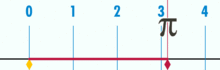
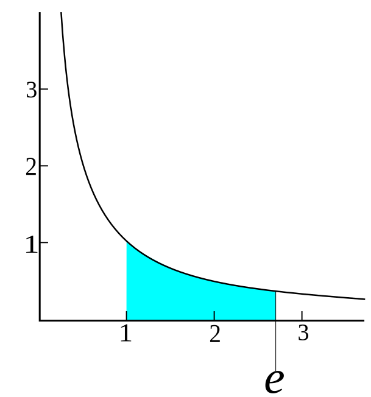
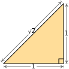
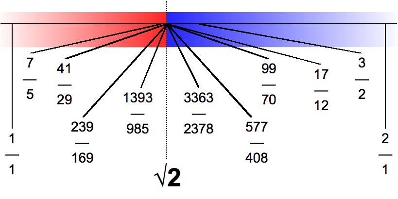

## Archimedes' constant `π`

> ≈ 3.14159 26535 89793 23846 26433 83279 50288

## Euler's number `e`

> ≈ 2.71828 18284 59045 23536 02874 71352 66249

## Pythagoras' constant `√2`

> ≈ 1.41421 35623 73095 04880 16887 24209 69807

## The imaginary unit `i`

> = √–1

